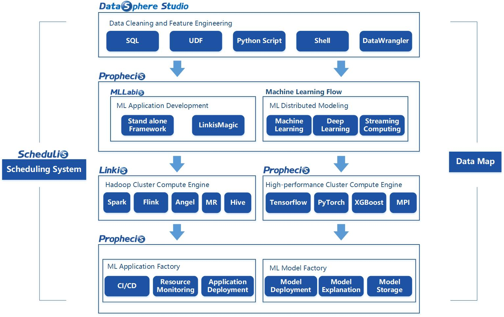
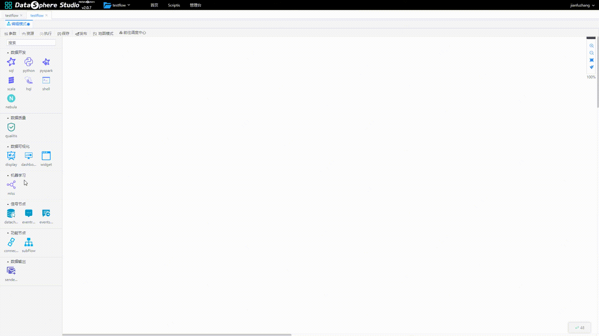

# Prophecis 

English | [中文](docs/zh_CN/Readme.md)

## Introduction

Prophecis is a one-stop machine learning platform developed by WeBank. It integrates multiple open-source machine learning frameworks, has the multi tenant management capability of machine learning compute cluster, and provides full stack container deployment and management services for production environment.

## Architecture
- #### Overall Structure
  

  **Five key services in Prophecis：**

- **Prophecis Machine Learning Flow**：Distributed machine learning modeling tool, with stand-alone and distributed mode model training functions, supports Tensorflow, Python, XGBoost and other machine learning frameworks, and supports the complete pipeline from machine learning modeling to deployment;

- **Prophecis MLLabis**：Machine learning development and exploration tools, providing development and exploration services. MLLabis is an online IDE based on Jupyter Lab. It also supports machine learning tasks for GPU and Hadoop clusters, supports Python, R, and Julia, and integrates Debug and TensorBoard plugins;

- **Prophecis Model Factory**： MF provides machine learning model storage, model deployment, AB Test, model management and other services;

- **Prophecis Data Factory**： DF provides feature engineering tools, data labeling tools and material management services;

- **Prophecis Application Factory**：AF is jointly developed by the big data platform team and AI Department of Webank.  It is based on QingCloud's open source system KubeSphere custom development, providing CI/CD and DevOps tools, GPU cluster monitoring and warning capabilities.

- #### Features

  

- **Whole Machine Learning Life Cycle Support**：Prophecis's MLFlow can be nested into the workflow of DataSphere Stdudio through AppJoint. Support the entire machine learning process from data upload, data preprocessing, feature engineering, model training, model evaluation, model release to model deployment.

  

- **One-Click Model Deployment Service**：Prophecis MF supports deploying models generated by Prophecis Machine Learning Flow and Propheics MLLabis as restful API or RPC interface with one click, so as to realize seamless connection between model and business system.

- **Comprehensive Management Platform**：Based on the community open source program customization, Prophecis provides complete, reliable, and highly flexible enterprise-level machine learning application release, monitoring, service management, log collection and query management tools, and realizes the full control of machine learning applications to meet the needs of enterprises Learn to apply all the work requirements of the online production environment.

## Quick Start Guide
- Read the  [Quick Start Guide](docs/zh_CN/QuickStartGuide.md) to quickly get going with **Prophecis**.
- About Configuration，Read key configuration explanation in [Quick Start Guide](docs/zh_CN/QuickStartGuide.md) .

## Developing
- Read the [Develop Guide](docs/zh_CN/DevelopGuide.md)  guide to quickly get how to develop **Prophecis**.

## Roadmap
- See our [Roadmap](docs/zh_CN/Roadmap.md) for what's coming soon in **Prophecis**.

## Contributing

Contributions are warmly welcomed and greatly appreciated.

## Communication

If you desire immediate response, please kindly raise issues to us or scan the below QR code by WeChat and QQ to join our group: ：

## License
Prophecis  is under the Apache 2.0 license. See the LICENSE file for details.
