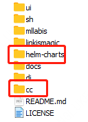

## 1. Prophecis简介

​	Prophecis 使用`helm`来进行`kubernetes`包管理，主要安装文件位于install目录下。install目录包含了三个组件`notebook-controller`, `MinioDeployment`, `Prophecis`，主体为`Prophecis`。使用前，需要初始化MySQL数据库，并挂载NFS目录来存储数据。


## 2. 环境准备

### 2.1 机器规划

### 2.2 软件

|**软件**|**版本**|**位置**|
|:----|:-----|:-----|
|Helm|3.2.1|https://github.com/helm/helm/releases|
|Kubenertes|1.18.6|https://github.com/kubernetes/kubernetes|
|Docker|19.03.9||
|nfs-utils|1.3.0|    |

* 验证Helm
```shell
$ helm version
version.BuildInfo{Version:"v3.2.1", GitCommit:"fe51cd1e31e6a202cba7dead9552a6d418ded79a", GitTreeState:"clean", GoVersion:"go1.13.10"}
```
* 验证Kubernertes
```shell
$ kubectl version
Client Version: version.Info{Major:"1", Minor:"19", GitVersion:"v1.19.3", GitCommit:"1e11e4a2108024935ecfcb2912226cedeafd99df", GitTreeState:"clean", BuildDate:"2020-10-14T12:50:19Z", GoVersion:"go1.15.2", Compiler:"gc", Platform:"linux/amd64"}
Server Version: version.Info{Major:"1", Minor:"18", GitVersion:"v1.18.6", GitCommit:"dff82dc0de47299ab66c83c626e08b245ab19037", GitTreeState:"clean", BuildDate:"2020-07-15T16:51:04Z", GoVersion:"go1.13.9", Compiler:"gc", Platform:"linux/amd64"}
```
* 验证Docker
```shell
$ docker version
...
Client: Docker Engine - Community
Version:           19.03.9
...
Server: Docker Engine - Community
Engine:
Version:          19.03.9
```
### 2.3 目录挂载

* NFS服务节点操作
```shell
# NFS服务节点IP地址  NFS_SERVER_IP='172.22.1.122'
# NFS挂载目录  NFS_PATH_LOG='/mlss/di/jobs/prophecis'
#
# 需要挂载的目录
# /data/bdap-ss/mlss-data/tmp
# /mlss/di/jobs/prophecis
# /cosdata/mlss-test
mkdir -p ${NFS_PATH_LOG}
# 追加写入到文件中，标明挂载信息
echo "${NFS_PATH_LOG} ${NFS_SERVER_IP}/24(rw,sync,no_root_squash)">> /etc/exports
# 刷新nfs，让服务节点使用该nfs挂载
exportfs -arv
```
* NFS客户端节点操作
```shell
# 需要对除Master节点外的其他节点执行挂载
mkdir -p ${NFS_PATH_LOG}
# 挂载目录
mount ${NFS_SERVER_IP}:${NFS_PATH_LOG} ${NFS_PATH_LOG}
```
## 3. 物料准备

* 安装包位置：`https://github.com/WeBankFinTech/Prophecis.git`
    * 安装包目录



* 文件清单：
    * Helm Chart：`./helm-charts`目录下`notebook-controller`,`MinioDeployment`,`Prophecis`
    * SQL Script ：`./cc/sql`目录下`prophecis.sql`和`prophecis-data.sql`文件
* 镜像列表（**安装时自动下载**）：
```yaml
# 版号	VERSION=v0.2.0
# Docker仓库位置
wedatasphere/prophecis:
# Docker标签
ui-${VERSION}
trainer-${VERSION}
restapiI-${VERSION}
lcm-${VERSION}
storage-${VERSION}
cc-apiserverC_${VERSION}
cc-apigateway-${VERSION}
jobmonitor-${VERSION}
mllabis-v0.1.1
master-97

wedatasphere/mllabis:
Prophecis_1.8.0_tensorflow-2.0.0-jupyterlab-gpu-v0.5.0
Prophecis_1.8.0_tensorflow-1.13.1-jupyterlab-cpu-v0.5.0
Prophecis_1.8.0_tensorflow-1.13.1-jupyterlab-gpu-v0.5.0
Prophecis_1.8.0_tensorflow-1.12.0-jupyterlab-gpu-v0.5.0
Prophecis_1.8.0_tensorflow-1.12.0-jupyterlab-cpu-v0.5.0
```
## 4. 配置文件修改

**需要修改****`./helm-charts/prophecis/values.yaml`****中的信息。**

### 4.1 配置数据库访问的信息

```yaml
# MySQLIP地址   DATABASE_IP='172.22.1.128'
# MySQL端口号    DATABASE_PORT='3306'
# MySQL数据库名  DATABASE_DB='mlss_db'
# MySQL用户名    DATABASE_USERNAME='mlss'
# MySQL用户密码  DATABASE_PASSWORD='123'
database:
    server: ${DATABASE_IP}
    port: ${DATABASE_PORT}
    name: ${DATABASE_DB}
    user: ${DATABASE_USERNAME}
    pwd: ${DATABASE_PASSWORD}
```
### 4.2 配置UI的URL访问路径

```yaml
# 网页访问地址  SERVER_IP='172.22.1.68'
# 网页访问端口  SERVER_PORT='30803'
server_ui_gateway: ${SERVER_IP}:30778
ui:
    service:
        bdap:
            nodePost: ${SERVER_PORT}
```
### 4.3 配置LDAP

Prophecis使用LDAP来负责统一认证

```yaml
# LDAP的服务地址  LDAP_ADDRESS='ldap://172.22.1.122:1389/' 
# LDAP的DNS解析地址 LDAP_BASE_DN='dc=webank,dc=com'
cc:
    ldap:
        address: ${LDAP_ADDRESS}
        baseDN: ${LDAP_BASE_DN}
```
## 5. 操作序列

### 5.1 数据库更新

**需要在MySQL命令行内载入文件**

在数据库内执行`./cc/sql`下的`SQL`文件`prophecis.sql`和`prophecis-data.sql`，需要使用SQL脚本来创建表结构和初始数据

```sql
source prophecis.sql
source prophecis-data.sql
```
### 5.2 创建`namespace`

Prophecis默认使用`kubernetes`的命名空间`prophecis`，需要创建

```shell
kubectl create namespace prophecis
```
### 5.3 给运行节点标签

Prophecis使用`kubernetes`的节点标签来识别用途

```shell
# 服务节点的标签  LABEL_CPU='mlsskf010001 mlsskf010002'
# GPU节点的标签  LABEL_GPU='mlsskf010003 mlsskf010004'

kubectl label nodes ${LABEL_CPU} mlss-node-role=platform
kubectl label nodes ${LABEL_GPU} hardware-type=NVIDIAGPU
```
### 5.4 安装组件

Prophecis部署需要三个组件`notebook-controller`,`MinioDeployment`,`Prophecis`。

**部署执行目录为****`./helm-Chart`****目录下。**

```shell
# 安装Notebook Controller组件
helm install notebook-controller ./notebook-controller
# 安装MinIO组件
helm install minio-prophecis --namespace prophecis ./MinioDeployment
# 安装prophecis组件
helm install prophecis ./prophecis
```

## 6. 环境验证

### 6.1 服务验证

* `kubectl get -n prophecis pod`查看所有服务是否正常`Running`，若异常通过`kubectl describe`及`kubectl log`查看异常原因
### 6.2 登录验证

* 所有Pod正常Running后，访问`http://${SERVER_IP}:${SERVER_PORT}`，默认账号为`admin`，密码`admin`。

