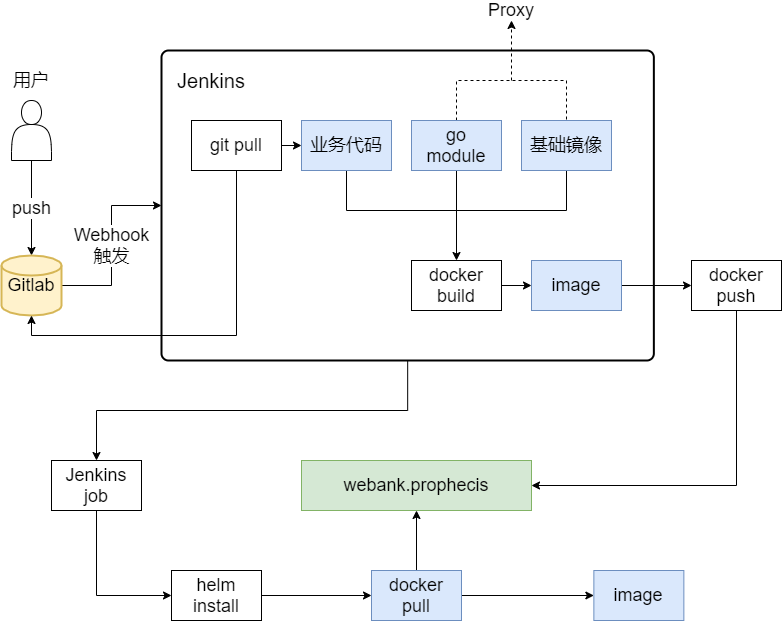
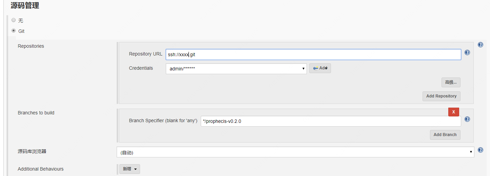
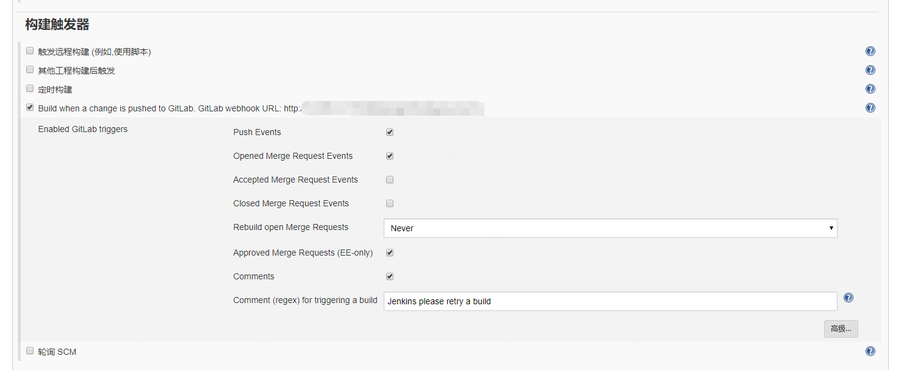
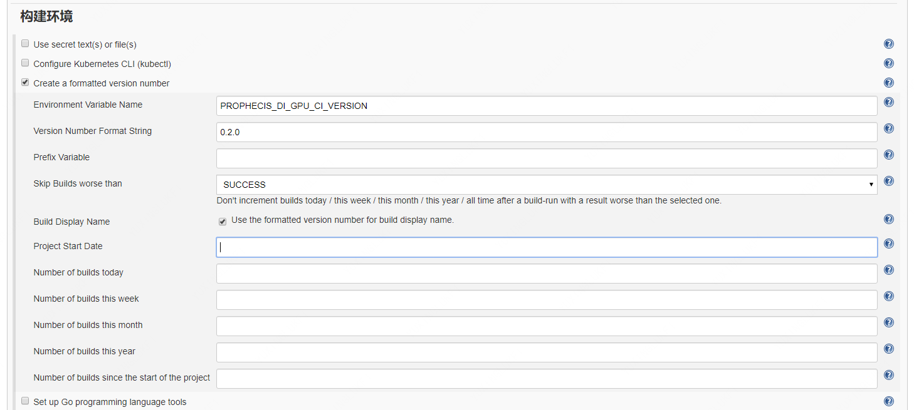
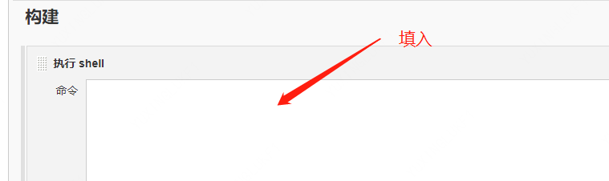
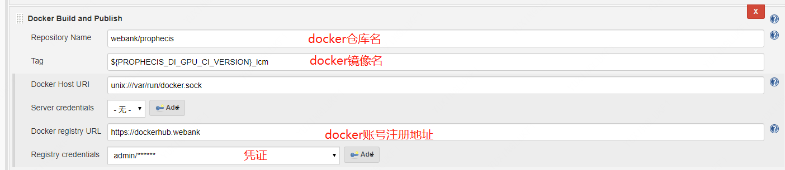

[TOC]


## 1. CI/CD构建

​	当新代码通过Git被push到Gitlab上或者合并了分枝就会触发Webhook，调用Jenkins的自动构建，在Jenkins的自动构建中，会执行GoBuild相关指令，编译代码，然会执行Docker build的相关指令，产生Docker镜像，之后推送到指定Docker仓库中。




### 1.1 Go Build

```shell
# 设置GOPROXY
export GOPROXY=http://goproxy.xxx.com/go version
# 进入工作目录
cd ${WORKSPACE}
# 构建各模块镜像,需要将所用模块填入
cd ${MMODULE}
CGO_ENABLED=0 GO111MODULE=on GOSUMDB=off GOOS=linux GOARCH=amd64 ${GO_DIR}/go build -v -o bin/main
```
### 1.2 Docker Build

需要将所有更新镜像进行处理，下面以某模块（${MODULE}）为例。

* 构建镜像
```shell
docker build -t webank/prophecis:${VERSION}_${MODULE}  --no-cache=true /var/lib/jenkins/workspace/PROPHECIS-DI-GPU-Develop/${MODULE}
```
* 修改镜像
```shell
# 修改镜像名
docker tag webank/prophecis:${VERSION}_${MODULE} webank/prophecis:${MODULE}-${VERSION}
# 上传镜像
docker push webank/prophecis:${MODULE}-${VERSION}
```
### 1.3 Helm Deploy

```shell
# 更新Helm
helm upgrade prophecis

# 若只更新configmap，需重新install
helm delete prophecis
helm install prophecis
```
### 1.4 Jenkins Case

#### 1.4.1 Gitlab配置
- WebHook配置：

    进入项目的Gitlab项目设置（Settings-Integrations）新增webhook，需填写以下信息：

    - URL：对应编译Jenkins的URL
    - Secret Token：Jenkins中对应项目的Token
    - Triggers勾选Push Events，同时填写对应分支
#### 1.4.2 Jenkins 配置
- 配置源码管理，填写好Repositories和Credentials和Branch。
    


* 配置触发器：
     * 勾选：Push Events、Opened Merge Request Event、Approved Merge Request、Comments
     * Rebuild open Merge Requests：Never




- 构建变量信息(用于版本管理)：
        - 勾选：Create a formatted version number
            - 填写：Environment Variable Name、Version Number Format String、Skip Builds worse than、Build Display Name（勾选）
            - AIDE:
            - 设置 Go Version




- 填写编译命令Go build:




- 填写镜像构建及推送相关:

	
	


 - 执行部署命令helm deploy(若编译和部署在同一台机器可直接填入部署命令，否则可以通过HTTP触发Kubernetes Master节点jenkins进行部署)


## 2. 远程调试

使用Golang调试工具Delve通过容器对外暴露的端口进行调试。

### 2.1 配置

本文以DI子系统的Rest服务为例，使用DLV进行远程调试：

#### 2.1.1 镜像编译

重新编译镜像，在原有镜像中添加DLV及Golang

```dockerfile
FROM golang
RUN go get -u github.com/go-delve/delve/cmd/dlv
 
USER root
 
ADD bin/main /
ADD certs/* /etc/ssl/dlaas/
ADD ./* /MLSS-DI-GPU/restapi/
RUN chmod 755 /main
 
ENTRYPOINT ["/main"]
```
#### 2.1.2 restapi-deployment.yml修改
```yaml
# dlv --listen为暴露的远程调试端口
spec:
  containers:
    command: ["/bin/sh", "-c"]
    args: ["dlv --listen=:40000 --headless=true --api-version=2 exec /main -- --DLASS_PORT=8080"]
```
#### 2.1.3 restapi-service.yml修改
```yaml
apiVersion: v1
kind: Service
metadata:
  name: di-restapi
  namespace: {{.Values.namespace}}
  labels:
    service: di-restapi
    environment: {{.Values.env}}
spec:
  type: NodePort
  ports:
  - name: ffdl
    port: 80
    targetPort: 8080
    nodePort: {{.Values.restapi.port}}
  - name: di-debug-port
    port: 40000
    targetPort: 40000
    nodePort: 30961
  selector:
    service: di-restapi
```
#### 2.1.4 IDE远程调试

VSCode和Goland配置Remote Debug连接40000端口即可，服务需要在IDE Remote Debug触发后才启动。

