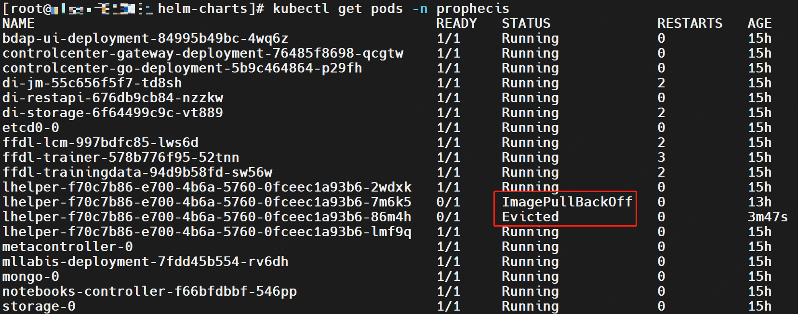
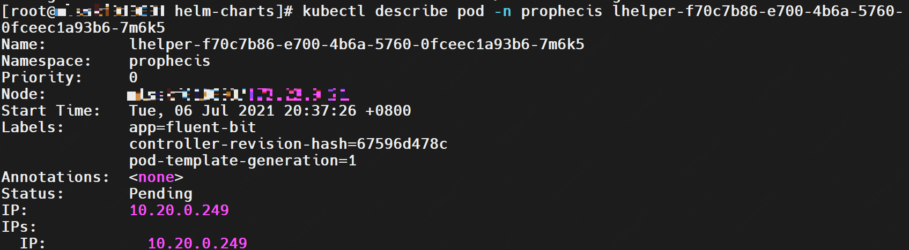
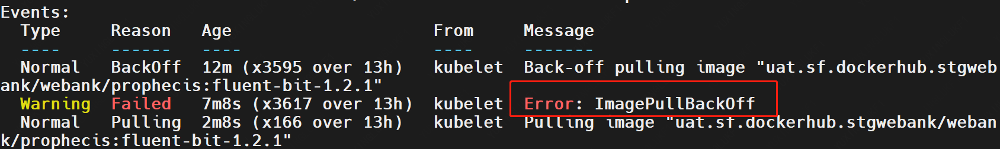

[TOC]


## 1. 常见问题

### 1.1 LogCollectorDS组件相关

1. `no matches for kind “DaemonSet“ in version “extensions/v1beta1“`

​       LogCollectorDS为kubernetes 1.8之前版本需要进行修改，将`LogCollectorDS/FluentBit.yaml`中的`extensions/v1beta1`改为`apps/v1`


2. missing required field "selector" in io.k8s.api.apps.v1sssssssssssss.DaemonSetSpec
   - LogCollectorDS为kubernetes 1.8之前版本需要进行修改，将`LogCollectorDS/FluentBit.yaml`添加3行，并注释2行
   ```yaml
   apiVersion: apps/v1
   spec:
   selector:
   matchLabels:
   app: fluent-bit
   template:
   metadata:
   creationTimestamp: null
   labels:
   # log_collector_image_short_name: fluent-bit
   # service: prophecis-lhelper
   app: fluent-bit
   ```


### 1.2 运行相关

1. `MountVolume.SetUp failed for volume "oss-storage" : hostPath type check failed`
nfs未进行挂载


2. `The node had condition: [DiskPressure]`

   磁盘警告，磁盘容量不够需要增加容量


3. `error: Kubernetes cluster unreachable`

    因为helm没有指定 apiserver位置，需要指定
    ```shell
    export KUBERNETES_MASTER=http://127.0.0.1:8080
    ```


4. `failed to pull image`
   镜像拉取失败，请在社区联系协助人员


5. `1 node(s) had taint {node.kubernetes.io/disk-pressure: }, that the pod didn't tolerate, 3 node(s) didn't match node selector.`
单cpu节点不够，需要增加节点


6. `Error response from daemon: Get https://dockerhub.prophecis/v2/: http: server gave HTTP response to HTTPS client`
docker registry未采用https服务，而客户端docker使用https请求push所致
将以下配置添加到 /etc/docker/daemon.json 中：

    ```shell
    { "insecure-registries":["127.0.0.1:5000"] }
    ```


## 2. 错误排查

### 2.1 常用命令

```shell
# 查看prophecis命名空间下节点的运行状态
kubectl get pods -n prophecis
# 对发生异常节点进行详细查看
kubectl describe pod -n prophecis ${ERROR_POD}
# 查看异常节点日志
kubectl logs -f ${ERROR_POD} -n prophecis
# 删除异常节点，尝试自行恢复
kubectl delete pod ${ERROR_POD} -n prophecis
```
### 2.2 样例

* 查看所有节点运行情况，`Runing`为正常运行状态，发现下图中出现`ImagePullBackOff`，`Evicted`状态




* 以一个节点为例，查看节点详细信息，发现是错误`ImagePullBackOff`，可能镜像缺失，重新上传镜像






```

```

```

```