### Prophecis用户文档

#### 一、MLLabis实验环境
#### 1、创建Jupyter Lab实验环境

- I. 进入模型开发页面，点击创建Notebook，设置名称，名称命名规范和K8s资源对象Name规范一致。

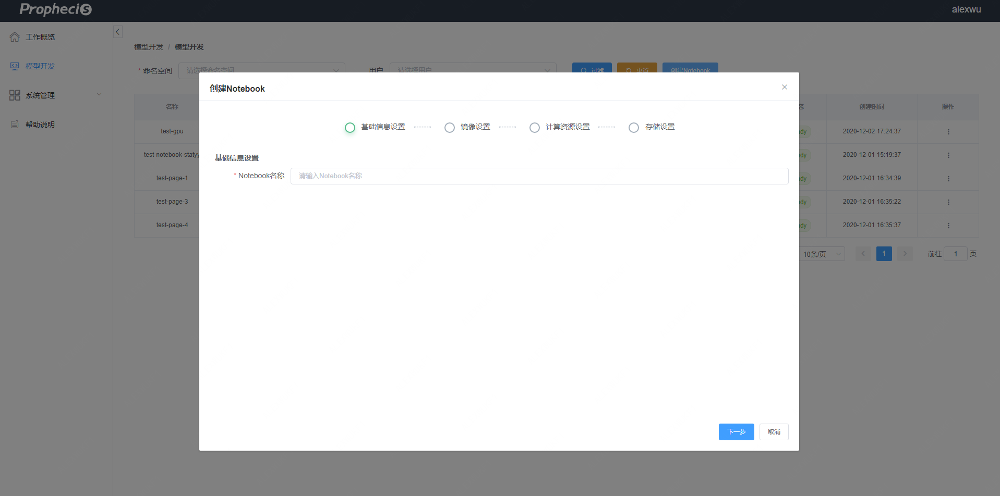

- II.镜像设置

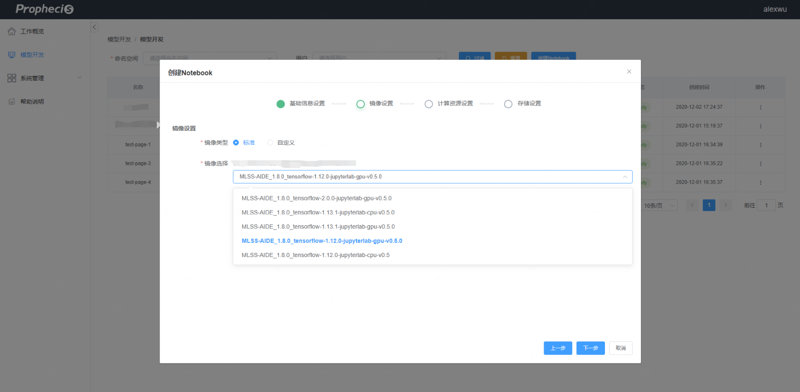

- III. 计算资源配置

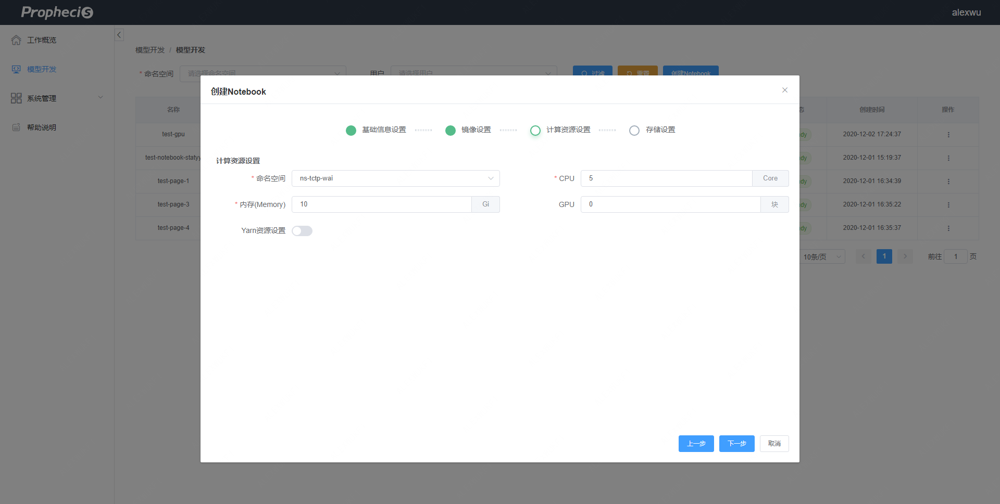

- III. 存储配置

  管理员在管理台上对用户所在用户组绑定的相应存储后，便可以在此使用，注意该存储需要在主机上事先配置好。

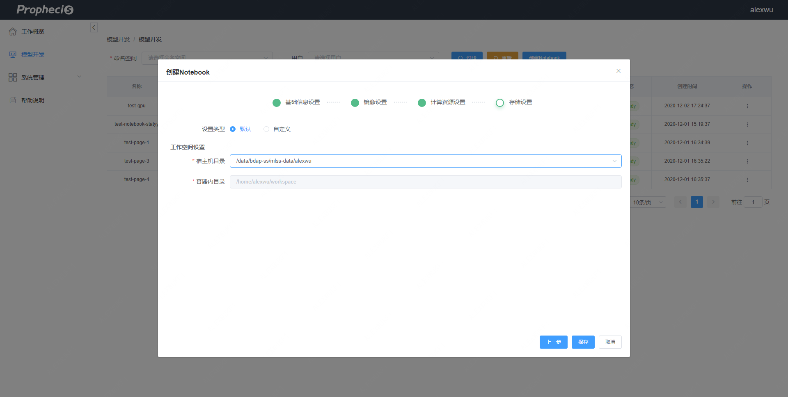

III. 保存后，等待Notebook Ready便可进入Jupyter Lab实验环境

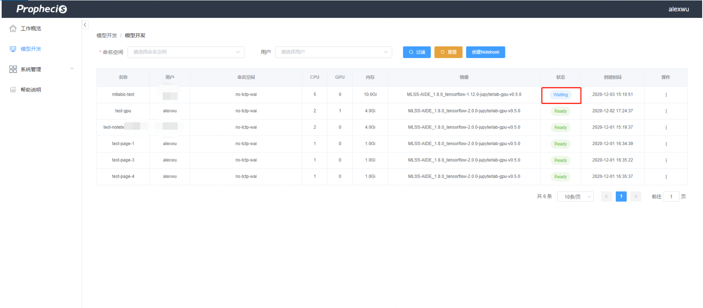

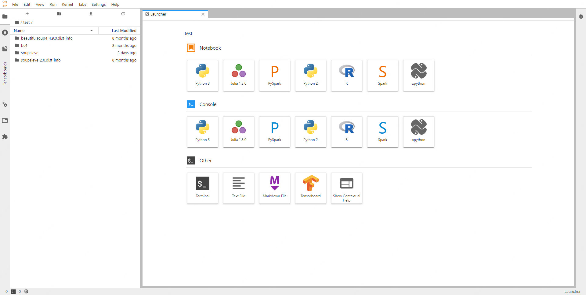

#### 2、Yarn相关资源配置（livy/linkis）

- 若部署了livy/linkis相关计算中间件，可在Notebook创建页面设置相应的Yarn队列使用资源，设置后资源会更新到容器的对应配置中

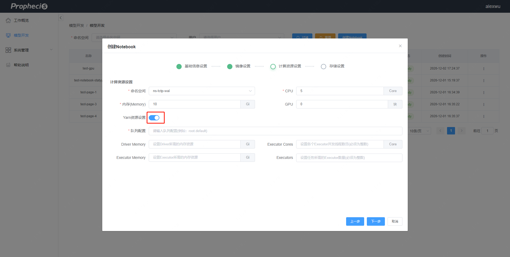

- 已创建的容器对象可以过资源设置按钮进行配置

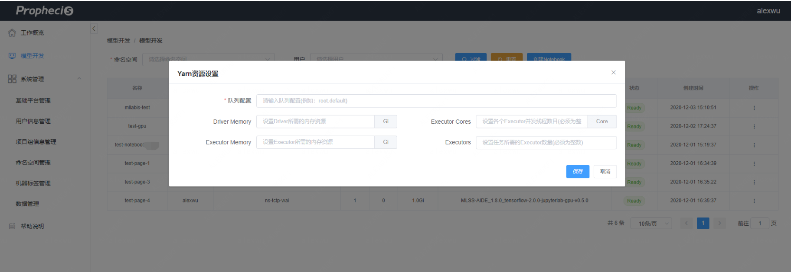

###  二、Prophecis-CC管理
#### 1、用户体系

- Prophecis项目组：每个用户会有相对应的用户组，通过用户组绑定对应的存储资源和计算资源，其中计算资源通过namespace来绑定对应机器，同时设置相应的K8s resource quota
  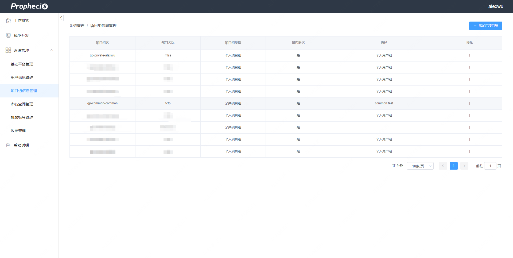
                                                                           

- Prophecis 用户存储设置：用户所使用的存储资源，通过用户组绑定，绑定后用户方可使用，注意需要在主机上设置对应的存储。

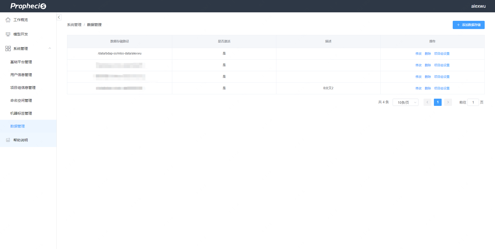

#### 2、机器标签体系
- Prophecis命名空间：k8s的命名空间，创建后会创建相应的resource quota，在机器标签页面绑定后可以设置资源。

  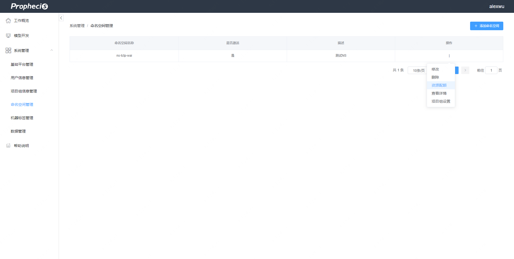
                                                                           

- Prophecis 机器标签页面：命名空间绑定可在此处对应的机器，设置资源配额后，对应命名空间的容器会运行到对应的节点上。
 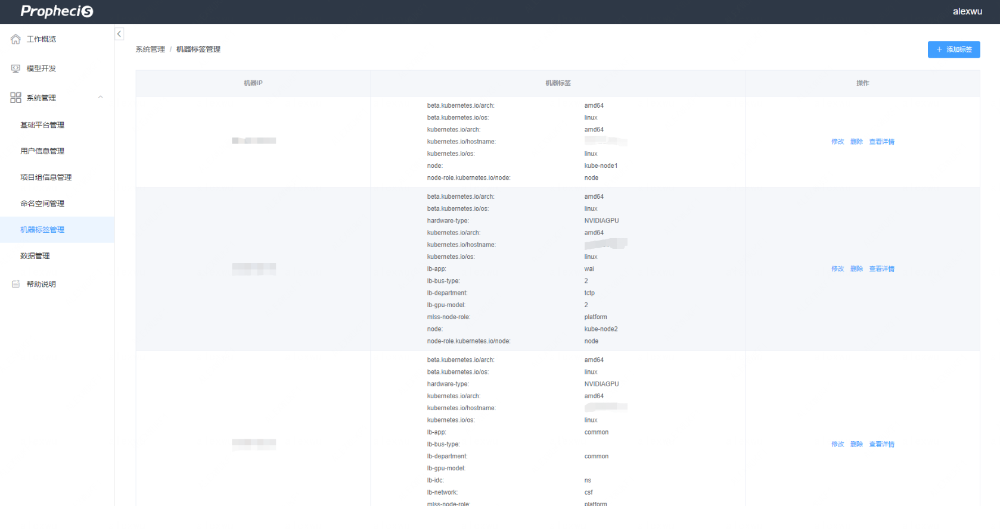

                                                                                
