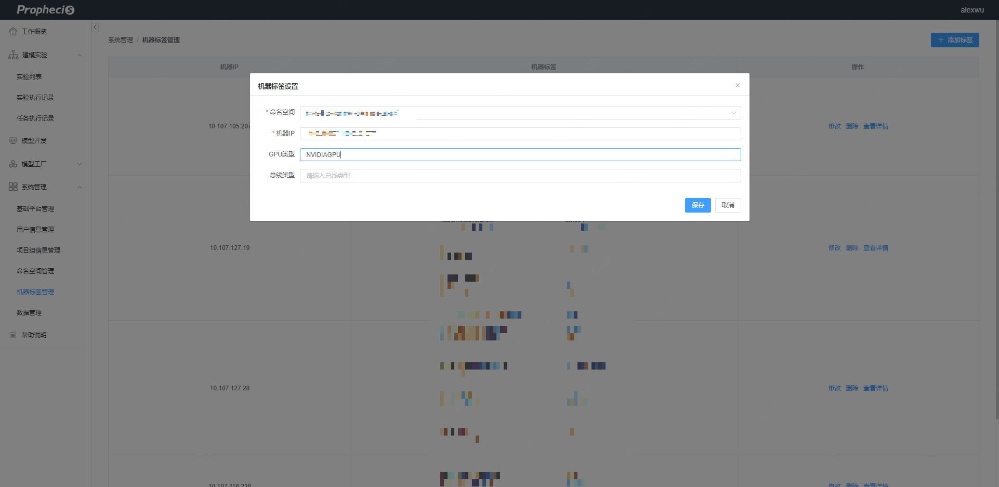
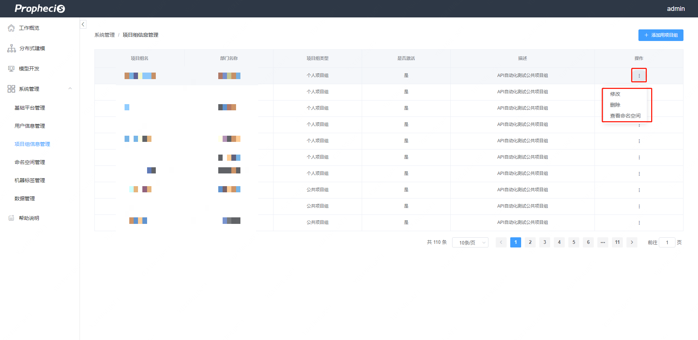

[TOC]

## 1. CC简介

CC控制台是负责Prophecis系统的平台控制，主要有基础平台管理、用户信息管理、项目组信息管理、命名空间管理、机器标签管理和数据管理等部分。管理员用户需要通过控制台创建命名空间，分配资源给用户，然后用户才可以进行模型开发和训练。

### 1.1 权限模式

权限是由user、role、group和namespace构成的权限体系

* user属于若干个group
* user在每个group中的role唯一
* 除了系统保留的namespace外，每个group拥有若干个namespace的使用权限
## 2. 命名空间管理

在命名空间管理中，可以看到已创建命名空间的信息，有命名空间名称、是否激活、基本描述和对于命名空间的一些操作。

### 2.1 创建命名空间

* 要创建命名空间，点击右上角添加命名空间

* 接下来进入命名空间创建的配置页面，命名空间的名字必须符合`ns-[department]-[application]`，确认后即可创建

### 2.2 命名空间配置

* 点击操作列下不同命名空间的扩展标签即可对命名空间进行修改、删除等操作。

* 可以在扩展标签中的资源配额选项中对命名空间的CPU、GPU和内存配置进行更改

### 2.3 资源配置

在新建命名空间后需要给命名空间添加机器，添加机器后后才能在该命名空间下申请资源。

* 给机器添加命名空间的标签

* 然后修改该命名空间的资源配额

之后就可以在该命名空间下创建notebook，分配资源进行模型开发了。

## 3. 用户信息管理

在用户信息管理页面中，可以看到用户名、用户UID、用户GID、用户类型、用户描述和对于用户的一些操作。

### 3.1 添加用户

* 点击右上角添加用户

* 进入用户设置页面，配置用户信息

### 3.2 用户信息修改

* 点击操作列下不同用户的扩展标签即可对用户进行修改、删除等操作。

* 可以在扩展标签中的修改选项中对用户的信息重新修改

## 4. 项目组信息管理

在项目组信息管理页面中，可以看到项目组名、部门名称、项目组类型和关于项目组的操作。

### 4.1 创建项目组

* 点击右上角添加项目组

* 配置项目组信息，项目组名需要符合`gp-[department]-[application]`

### 4.2 修改项目组信息

* 点击操作列下不同项目组的扩展标签即可对项目组进行修改、删除等操作。

* 可以在扩展标签中的修改选项中对项目组的信息重新修改

