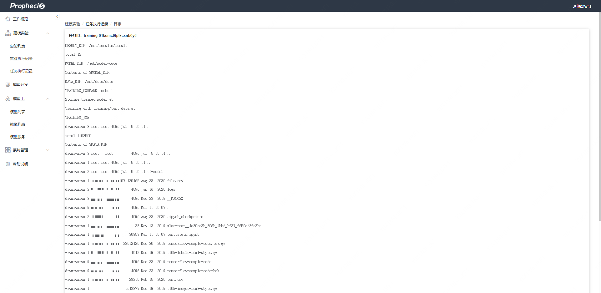

[toc]


## 1. DI简介

DI是Prophecis的子系统，支持用户选择单机或者分布式的方式来训练模型，用户可以通过UI访问申请训练所需要的CPU和GPU资源，DI子系统会依据用户配置的信息来分配相应的资源。

## 2. DI分布式建模

### 2.1 分布式建模列表页面

该页面中包含已创建任务得主要信息，包括任务ID、任务名称、命名空间等，其中：

* 命名空间（namespace）：管理员用户通过CC控制台创建，与所用硬件资源相关。
* 状态：任务的运行状态，分为QUEUED、PENDING、RUNNING、FAILED、COMPLETED。


### 2.2 创建GPU集群任务

点击创建GPU集群任务后，根据创建任务的引导填写任务相关信息，创建任务需填写以下信息：基础信息设置、镜像设置、计算资源设置、训练任务目录设置、任务告警设置、任务执行设置。

#### 2.2.1 单机任务填写范例

1. **基础信息配置**
* 任务名称及备注：配置任务名称、任务描述等基本信息


2. **镜像配置**
* 镜像类型：标准为列表中提供的镜像，自定义可设置任意Tag
* 镜像名称：Docker Image Tag


3. **计算资源配置**
* 命名空间：命名空间会与硬件机器做绑定，对应命名空间下的任务会启动到对应的服务器上面。
* 任务类型：在任务资源页面任务类型可选择单机或分布式，分布式任务即tensorflow的分布式模式，下图为单机模式的范例。
* CPU/GPU/Mmemory：填写执行任务所需的CPU/GPU/Memory即可。


4. **训练任务目录配置**

训练任务目录配置进行存储以及任务的相关目录。

* 训练数据存储根目录: 代表宿主机目录（即执行代码机器的目录）
* 训练数据子目录: 通常作为存放数据的目录，和DATA_DIR相对应。
* 训练结果子目录: 通常作为存放日志的目录，和RESULT_DIR相对应。


5. **任务执行设置**
* 执行入口设置：

配置执行任务的代码入口，提交方式可以为上传代码和训练代码子目录。

* 执行代码设置：
    * 上传代码：手动上传代码压缩包
    * 训练代码子目录：使用宿主机共享目录中的代码
    * 环境变量：设置完代码目录，会在容器生成一下环境变量：
        * ${MODEL_DIR}:
            * 选择训练代码子目录时，宿主机路径为训练数据存储根目录+训练代码子目录
            * 选择上传代码时，依据解压代码zip后的代码文件所在位置填写即可
        * ${DATA_DIR}: 宿主机路径为 训练数据存储根目录+训练数据子目录
        * ${RESULT_DIR}: 宿主机路径为 训练数据存储根目录+训练结果子目录


6. **任务告警配置**

告警配置，配置任务执行的相关告警，可以添加多个告警，也可以不配置。


#### 2.2.2 分布式任务填写范例

分布式任务和单机任务填写的唯一差别页面在资源配置页面。当选择为分布式时，分布式任务需要额外填写参数服务器数量，参数服务器CPU，参数服务器内存，参数服务器镜像。

**资源配置页填写范例:**


并且这部分信息会通过环境变量映射到代码中，可以通过环境变量设置`Tensorflow.train.ServerDef`:

```python
tf_config_json = os.environ.get("TF_CONFIG", "{}")
tf_config = json.loads(tf_config_json)
task = tf_config.get("task", {})
cluster_spec = tf_config.get("cluster", {})
cluster_spec_object = tf.train.ClusterSpec(cluster_spec)
job_name = task["type"]
task_id = task["index"]
server_def = tf.train.ServerDef(
cluster=cluster_spec_object.as_cluster_def(),
protocol="grpc",
job_name=job_name,
task_index=task_id)
server = tf.train.Server(server_def)
```
### 2.3 查看任务日志

任务列表可以看到当前任务的执行状态，更详细的任务执行情况可以通过查看日志，日志会包含任务的一些信息，同时py执行时的控制台输出也会显示在上面。当任务处于COMPLETED时，任务处于完成状态，之后可到相应result目录查看结果。




* 查看已提交的任务配置详情
* 查看任务训练日志
* 删除现有任务
    * 如果任务正在运行，会马上进行容器清除工作并删除
    * 如果任务已经已完成的任务则会删除历史信息
## 3. CLI使用

### 3.1 CLI介绍

CLI是Prophecis-DI提供的命令行工具，可以对Prophecis-DI进行基本的命令操作，包括提交任务、查看任务列表、查看任务日志等。使用CLI之前必须先进行基本的部署操作（获取CLI文件以及环境配置配置）。

### 3.2 CLI基本命令

* 执行$CLI_CMD help可以查看命令的相关帮助
```shell
$ $CLI_CMD help
NAME:
   bluemix dl - A new cli application
USAGE:
   ffdl-linux [global options] command [command options] [arguments...]
COMMANDS:
   init      bx dl init NAME
   train     bx dl train MANIFEST_FILE (MODEL_DEFINITION_ZIP|MODEL_DEFINITION_DIR)
   show      bx dl show MODEL_ID
   delete    bx dl delete MODEL_ID
   list      bx dl list
   download  bx dl download MODEL_ID (--definition|--trainedmodel) [--filename FILENAME]
   logs      bx dl logs MODEL_ID [--follow] [--metrics]
   loglines  bx dl loglines MODEL_ID [--follow] [--metrics]
   emetrics  bx dl emetrics MODEL_ID [--follow] [--metrics]
   halt      bx dl halt MODEL_ID
   version   bx dl version
   help, h   Shows a list of commands or help for one command
GLOBAL OPTIONS:
   --help, -h  show help
```

$CLI_CMD train

* 执行`$CLI_CMD train <用户代码文件夹>/<任务描述文件> <用户代码文件夹>`命令 可以提交任务到Prophecis-DI，任务描述文件代表提交任务的相关参数。
### 3.3 任务定义manifest文件

* 通过上传代码提交任务方式，manifest文件模板：
```yaml
name: tf-convolutional-network-tutorial
description: Convolutional network model using tensorflow
version: "1.0"
gpus: 1
cpus: 1
memory: 1Gb
# 资源所在的命名空间
namespace: ns-common-common-prophecis--test
code_selector: codeFile
data_stores:
  - id: hostmount
    type: mount_volume
    training_data:
      container: data
    training_results:
      container: result
    connection:
      type: host_mount
      name: "host-mount"
      # 用户目录
      path: "/data/bdp/prophecis-data/admin"
framework:
  # 镜像仓库
  name: "wedatasphere/di"
  # 镜像名字
  version: "tensorflow-1.14.0-gpu-py3"
  command: >
    python3 ${MODEL_DIR}/tf-model/convolutional_network.py --trainImagesFile ${DATA_DIR}/train-images-idx3-ubyte.gz
      --trainLabelsFile ${DATA_DIR}/train-labels-idx1-ubyte.gz --testImagesFile ${DATA_DIR}/t10k-images-idx3-ubyte.gz
      --testLabelsFile ${DATA_DIR}/t10k-labels-idx1-ubyte.gz --learningRate 0.001
      --trainingIters 2000
```
* 通过通过训练代码子目录提交任务，manifest文件模板：
```yaml
name: tf-convolutional-network
description: Convolutional network model using tensorflow
version: "1.0"
gpus: 1
cpus: 1
memory: 1Gb
# 资源所在的命名空间
namespace: ns-common-common-test
code_selector: storagePath
data_stores:
  - id: hostmount
    type: mount_volume
    training_data:
      container: data
    training_results:
      container: result
    training_workspace:
      container: workspace
    connection:
      type: host_mount
      name: "host-mount"
      # 用户目录
      path: "/data/bdp/prophecis-data/admin"
framework:
  # 镜像仓库
  name: "wedatasphere/di"
  # 镜像名字
  version: "tensorflow-1.14.0-gpu-py3"
  command: >
    python3 ${MODEL_DIR}/tf-model/convolutional_network.py --trainImagesFile ${DATA_DIR}/train-images-idx3-ubyte.gz
      --trainLabelsFile ${DATA_DIR}/train-labels-idx1-ubyte.gz --testImagesFile ${DATA_DIR}/t10k-images-idx3-ubyte.gz
      --testLabelsFile ${DATA_DIR}/t10k-labels-idx1-ubyte.gz --learningRate 0.001
      --trainingIters 2000
```
### 3.4 CLI文件安装

1. **准备训练的CLI二进制文件**

将CLI文件夹拷贝至Prophecis的文件目录下。

2. **配置环境变量**
```shell
export DLAAS_URL=http://127.0.0.1:30959
export CLI_CMD=/data/Install/ProphecisInstall
export MLSS_AUTH_USER=<用户名>
export MLSS_AUTH_PASSWD=<base64编码后的用户密码>
export MLSS_AUTH_TYPE=UM
```
3. **验证安装成功**

执行$CLI_CMD list，若成功获取任务列表，代表安装成功。


