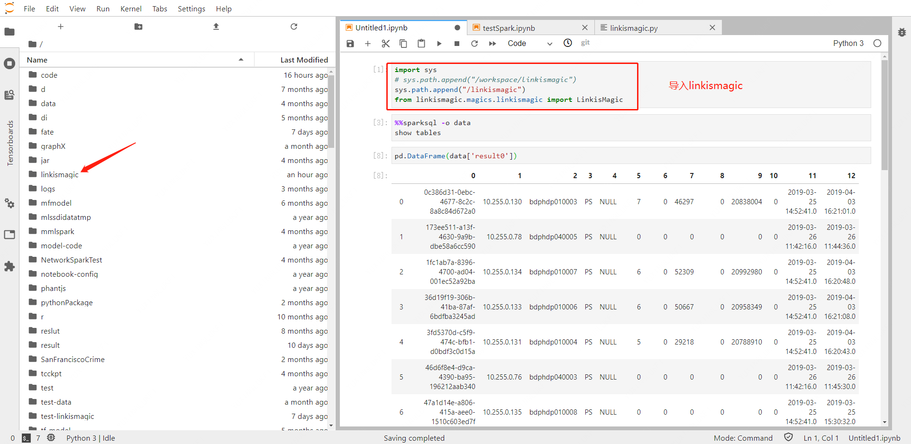

[toc]


## 1. MLLabis简介

MLLabis是Prophecis的个人开发环境子系统，允许用户创建Notebook来在线编辑代码和开发模型，同时支持Hadoop和Spark的集成开发环境，方便用户开发。

## 2. Notebook管理

### 2.1 创建Notebook


进入个人开发环境后，在个人开发环境页面中包含已创建Notebook得列表信息，包括名称、用户、命名空间等。点击创建notebook之后，按步骤填写创建Notebook的相关信息，依次为基础信息设置、镜像设置、计算资源设置、存储设置，其中：

1. **基础信息设置**


设置Notebook名称以及命名空间，其中命名空间与所用的硬件资源绑定。

2. **镜像设置**


选择Notebook所需Tensorflow版本的镜像，需使用到GPU资源请使用GPU类别的镜像。

3. **计算资源设置**


根据对任务对CPU、内存、GPU的需求，填写计算资源设置。其中，其他资源设置代表GPU资源，必须为整数，单位为块，不填时默认为0块。

4. **存储设置**


代码和数据的持久化目录，若选择不进行挂载，则数据和代码无法进行持久化。**若需对文件进行持久化保存，请务必填写宿主机目录。**

**工作空间：**挂载后工作后可在Notebook中使用持久化存储的文件，通常将工作空间定义为Notebook存放代码文件的目录。

* 宿主机目录:  文件的实际保存目录。
* 容器内目录：映射到Notebook在容器中的目录，与宿主机目录相对应。

**数据空间：**与工作空间相同，可进行目录挂载，通常将数据空间进行与数据文件相关的目录挂载，数据空间可以填写多个，也可以选择不填。在notebook中使用该数据时，该数据的路径为容器内目录的路径。

### 2.2 访问Notebook

创建完之后，回到Notebook列表页面等待系统调度资源创建Notebook，刷新页面直到可以访问。


进入Notebook之后，在Lanucher页面可以创建Notebook、Console、Text、Tensorboard等文件，Notebook支持python2和python3版本。


### 2.3 删除Notebook


Notebook创建完之后，会一直占用资。删除之后，会从内存中删除，如果没有挂载目录，notebook中的文件将会被永久删除。

## 3. AIDE Notebook 常用功能介绍

### 3.1 Notebook主要功能

* Notebook使用原生Jupyter Lab，具体文档可参考Jupyter Lab相关使用。
>https://jupyterlab.readthedocs.io/en/latest/

## 4. 大数据平台功能

### 4.1 HDFS的接入

* Hadoop相关客户端文件及配置，需要采用文件挂载的方式让Notebook可以调用，并且Hadoop的相关文件对于使用用户是可读或可执行。
* Notebook中的TensorFlow读取HDFS文件，需要配置变量并读取，编写到sh文件Notebook_ENV.sh中。
```shell
export JAVA_HOME=
source env.sh #HDFS ENV Config
# Tensorflow HDFS ENV
source ${HADOOP_HOME}/libexec/hadoop-config.sh
export
LD_LIBRARY_PATH=${LD_LIBRARY_PATH}:${JAVA_HOME}/jre/lib/amd64/server
export CLASSPATH=$(${HADOOP_HOME}/bin/hadoop classpath --glob)
```
* 在Notebook的host配置namenode的相关地址，并且HOST地址的相关配置都写入HOST_ENV.sh中。
```shell
echo "127.0.0.1   hadoop01" >>/etc/hosts
```
* 在Notebook的启动脚本加载HDFS、HOST的相关配置
```shell
source `${DIR}/Notebook_ENV.sh sh ${DIR}/HOST_ENV.sh'
```
### 4.2 HFDS使用

AIDE Notebook可接入HDFS，可以在Notebook中使用Tensorflow API读取数据或者使用HDFS的Python Package对BDAP集群HDFS文件进行操作。

* Tensorflow API操作（需要在HDFS位置中存放文件）

使用tensorflow.data.Dataset提供的API，写入HDFS文件的位置便可以对文件进行读取，下面是相关Case:

```python
# tensorflow 版本 1.12
import tensorflow as tf
# hadoop文件位置
file_name_string="hdfs://bdphdp110002:8020/tmp/hduser05/train_test_hadoop.csv"
# 读取数据文件
dataset = tf.data.TextLineDataset(file_name_string)
# 以" "切分文件每行数据
dataset = dataset.map(lambda string: tf.string_split([string]).values)
# 抽取样本数量
dataset = dataset.batch(2)
# 创建单次迭代器
iterator = dataset.make_one_shot_iterator()
# 获取元素
next_element = iterator.get_next()
with tf.Session() as sess:
print(sess.run(next_element))
## train_test_hadoop.csv 文件内容
## 1 2 1 3 5 1
## 2 3 4 5 3 1
## 执行结果
## [[b'1' b'2' b'1' b'3' b'5' b'1']
##  [b'2' b'3' b'4' b'5' b'3' b'1']]
```

* HDFS Python Package

AIDE Notebook中提供Pyarrow作为操作HDFS的Python Package，Pyarrow通过libhdfs.so操作HDFS，并且Notebook仅提供libhdfs.so。

**I.**首先需要创建操作HDFS的对象（示例）：

```python
pyarrow.HadoopFileSystem(host=bdphdp110002.webank”,port=8020)
```
**II.**pyarrow.HadoopFileSystem相关API操作，大部分方法和文件系统命令一致：
* cat:
* chmod
* chown
* download
* upload
* ls
* open
* mkdir
* rm

PyArrow HDFS Doc：

>[https://arrow.apache.org/docs/python/filesystems.html#hadoop-file-system-hdfs](https://arrow.apache.org/docs/python/filesystems.html#hadoop-file-system-hdfs?fileGuid=tKdM5R8LGe4brDMu)
* 使用Case：
```python
import pyarrow
# 连接HDFS
fs = pyarrow.HadoopFileSystem(host="bdphdp110002",port=8020)
fs.ls("/tmp/hduser05/hdfs_test")
fs.cat("/tmp/hduser05/hdfs_test/test_parraow.txt")
```
* 文件上传到HDFS（需要HDFS已存在文件）
```python
# 写入到HDFS中
import pyarrow
# 连接HDFS
hdfs = pyarrow.HadoopFileSystem(host="bdphdp110002",port=8020)
# 打开notebook所在目录文件
with open("./test_parraow.txt","rb") as fr:
# 打开HDFS所在目录文件
with hdfs.open("/tmp/hduser05/hdfs_test/test_parraow.txt","wb") as hdfswrite:
while True:
data = fr.read(4096)
if not data:
break
# 写入HDFS文件
hdfswrite.write(data)
```
* HDFS文件下载
```python
# 读取到notebook中
import pyarrow
# 连接HDFS
hdfs = pyarrow.HadoopFileSystem(host="bdphdp110002",port=8020)
# 打开notebook所在目录文件
with open("./test.txt","wb") as fw:
# 打开HDFS所在目录文件
with hdfs.open("/tmp/hduser05/hdfs_test/test_parraow.txt","rb") as hdfsread:
while True:
data = hdfsread.read(4096)
if not data:
break
fw.write(data)
```

### 4.3 PySpark的接入

* 前置条件
    * Spark集群的Python版本与Jupyter Lab(Driver)的Python版本一致，Spark集群Python位置可以通过设置PYSPARK_PYTHON环境变量来设置。
    * 容器内有端口可以与Spark集群进行通信，保证Spark集群能成功回调Spark Driver，需要有宿主机IP及端口的支持。
* 组件相关配置全部写入到env.sh中。
```shell
# Spark相关配置
export SPARK_HOME=/appcom/Install/spark
export SPARK_CONF_DIR=/appcom/config/spark-config/spark-submit
export SPARK_CMD=/appcom/Install/spark-cmd
# Hive相关配置
export HIVE_HOME=/appcom/Install/hive
export HIVE_LIB=/appcom/Install/hive/lib
export HIVE_CONF_DIR=/appcom/config/hive-config
alias hive="hive -i $HIVE_CONF_DIR/init_sql/${USER}_hive.sql"
# Path配置
PATH=/home/hadoop/script:$JAVA_HOME/bin:$HADOOP_HOME/bin:$HADOOP_HOME/sbin:$HIVE_HOME/bin:$SPARK_CMD/bin:$PATH
export PATH
```
* Notebook中iPython启动Spark的相关配置写入到Notebook_ENV.sh中。
```shell
# 额外的Python库路径
PYTHONPATH=/appcom/Install/AnacondaInstall/Anaconda3-5.1.0/bin/python
# 集群中使用的Python路径
PYSPARK_PYTHON=/appcom/Install/AnacondaInstall/Anaconda3-5.1.0/bin/python
# Spark Driver所用的Python路径
PYSPARK_DRIVER_PYTHON=/opt/conda/bin/python
```
* Notebook镜像安装好Pyspark-2.4.3 & Py4j-0.10.7。
* 在Notebook的启动脚本加载Spark的相关配置。
```shell
source ${DIR}/env.sh
source ${DIR}/Notebook_ENV.sh
source ${DIR}/Notebook_Host.sh
```
* 为每一个Notebook CRD配置一个NodePort类型的Service。
* Service通过Namespace和Name对CRD进行绑定，Service yaml模板如下。
```yaml
kind: Service
apiVersion: v1
metadata:
name: ${notebook_name}-service
spec:
type: NodePort
selector:
name: ${notebook_name}
namespace: ${notebook_namespace}
```
### 4.4 PySpark使用

AIDE Notebook可接入Spark，Notebook上支持使用Pyspark，支持Spark Core以及Spark SQL的相关操作。目前支持两种使用方式：

* 通过Pyspark Kernel连接Spark集群
* 通过Python Package连接Spark集群
### 4.5 Python Package连接Spark集群

* 创建SparkSession示例
```python
import pyspark
from pyspark.sql import SparkSession
import os
#******************************************
# 创建SparkSession并配置yarn集群连接
ss = SparkSession \
.builder \
.master('yarn') \
.config('spark.hadoop.yarn.timeline-service.enabled','false') \
.config('spark.driver.host',os.environ['Driver_Host']) \
.config('spark.driver.bindAddress','0.0.0.0') \
.config('spark.driver.port',os.environ['Spark_Driver_Port']) \
.config('spark.driver.blockManager.port',os.environ['Spark_Driver_BlockManager_Port']) \
.config(conf=pyspark.SparkConf().setAll([('spark.yarn.queue', 'dws')])) \
.getOrCreate()
#*********************以上参数不得更改，否则可能无法提交任务到Yarn集群********************
# AppName和Queue可根据实际情况修改
ss = ss.builder \
.appName('test_spark') \
.config(conf=pyspark.SparkConf().setAll([('spark.yarn.queue', 'dws')])) \
.getOrCreate()

# 设置Excutor和Spark Driver参数
ss = ss.builder \
.config('spark.executor.memory', '2g') \
.config("spark.executor.cores", '4') \
.config("spark.driver.memory","10g") \
.config("spark.driver.maxResultSize","0") \
.getOrCreate()
# 创建Spark Context
sc = ss.sparkContext
```
* Spark RDD创建示例
```python
import numpy as np
# 以下省略SparkSession创建
def mod(x):
return (x, np.mod(x, 2))
rdd = sc.parallelize(range(1000)).map(mod).take(10)
print(rdd)
```
* Spark SQL创建示例
```python
ss.sql("show tables").show()
```

### 4.6 SparkMagic使用(Livy)

* 进入Notebook镜像后，打开Pyspark Kernel，运行任意代码，Pyspark kernel会自动创建sparkContext和hiveContext：分别在sqlContext和sc变量中。


* 另外也可以通过sparkmagic的magic函数%%sql，直接写SQL进行查询：


### 4.7 LinkisMagic使用

满足用户在AIDE Notebook中通过LinkisMagic+Linkis提交任务到Hadoop和Spark集群。

* 申请Yaml资源

资源设置后会有一定延迟，并且需要重新创建ipython kernel。


* 进入notebook

需要先导入linkismagic库



* 已定义的魔法函数
|%listengine|显示Linkis engine信息|
|:----|:----|
|%listjob|列出Linkis Job的列表|
|%enginkill -i ${engineManagerInstance<br>}|结束对应Linkis engine进程|
|%log -i ${strongerExecId<br>}|查看对应Linkis Job的日志信息|
|%%spark|使用Spark命令|
|%%pyspark|使用Pyspark命令|
|%%sparksql|执行SparkSQL命令|

* %%pyspark
    * -o 将Linkis返回的结果集放到-o指定的变量中，返回的结果集是以JSON为格式，以{"result()":{}}为格式封装在字典的value中。
    * -p 填写此参数时会将文件下载到该目录中，根路径为/workspace。
    * -q 是否将结果集输出显示，-qfalse为显示，默认为true不显示。
    * -v 将魔法函数代码中的变量传输到Notebook iPython中。
    * -u 将MLLabis Notebook中定义的变量传输到Linkis中。
    * example 1
        * -q false显示了变量值，-o参数将print输出结果放到了字典中。


* * example 2
    * -v 参数将魔法函数代码中的变量传输到Notebook iPython中，所以可以查看数据。


* %%sparksql
    * -o 将LInkis返回的结果集放到-o制定的变量中，返回的结果集是以JSON为格式，以{"result()":{}}为格式封装在字典的value中。
    * -p 填写此参数时会将文件下载到该目录中，根路径为/workspace。
    * -q 是否将结果集输出显示，-q false为显示，默认为true不显示。

* %%spark
    * -o 将LInkis返回的结果集放到-o制定的变量中，返回的结果集是以JSON为格式，以{"result()":{}}为格式封装在字典的value中。
    * -p 填写此参数时会将文件下载到该目录中，根路径为/workspace。
    * -q 是否将结果集输出显示，-q false为显示，默认为true不显示。

